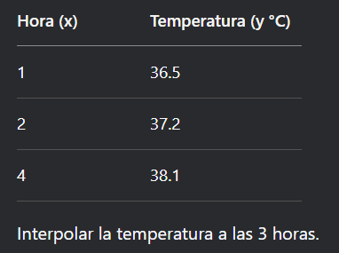

# Interpolacion

## Índice
1. [Interpolacion Lineal](#interpolacion-lineal)
2. [Interpolacion Polinomica Newton](#interpolacion-newton)
3. [Minimos Cuadrados](#minimos-cuadrados)
4. [Correlacion](#metodo-correlacion)

---

### Interpolacion Lineal

### Pseudocódigo

Proceso InterpolacionLineal

    Definir datoX0, datoY0, datoX1, datoY1, datoX, resultado, pendiente Como Real
    
    Escribir "INTERPOLACION LINEAL"
    Escribir "Ingresa el valor de x0: "
    Leer datoX0
    Escribir "Ingresa el valor de y0: "
    Leer datoY0
    Escribir "Ingresa el valor de x1: "
    Leer datoX1
    Escribir "Ingresa el valor de y1: "
    Leer datoY1
    Escribir "Ingresa el valor de x a interpolar: "
    Leer datoX
    
    pendiente <- (datoY1 - datoY0) / (datoX1 - datoX0)
    resultado <- datoY0 + pendiente * (datoX - datoX0)
    
    Escribir "El valor interpolado de y es: ", resultado

FinProceso

### Caso de prueba
 

### Resultado
El valor interpolado de y es: 37.65 

---

### Interpolación Polinómica Newton

### Pseudocódigo

Proceso InterpolacionNewton
    Definir cantidadDatos, indice1, indice2 Como Entero
    Definir valoresX, valoresY, tablaDD Como Real
    Definir puntoBuscado, resultadoFinal, acumulador Como Real
    
    cantidadDatos <- 3
    Dimension valoresX[4], valoresY[4], tablaDD[4,4]
    
    valoresX[1] <- 1; valoresY[1] <- 10
    valoresX[2] <- 3; valoresY[2] <- 25
    valoresX[3] <- 6; valoresY[3] <- 55
    
    Para indice1 <- 1 Hasta cantidadDatos Hacer
        tablaDD[indice1,1] <- valoresY[indice1]
    FinPara
    
    Para indice2 <- 2 Hasta cantidadDatos Hacer
        Para indice1 <- 1 Hasta cantidadDatos-indice2+1 Hacer
            tablaDD[indice1,indice2] <- (tablaDD[indice1+1,indice2-1]-tablaDD[indice1,indice2-1])/(valoresX[indice1+indice2-1]-valoresX[indice1])
        FinPara
    FinPara
    
    puntoBuscado <- 4
    resultadoFinal <- tablaDD[1,1]
    acumulador <- 1
    
    Para indice1 <- 2 Hasta cantidadDatos Hacer
        acumulador <- acumulador * (puntoBuscado - valoresX[indice1-1])
        resultadoFinal <- resultadoFinal + tablaDD[1,indice1] * acumulador
    FinPara
    
    Escribir "El valor interpolado en x = ", puntoBuscado, " es: ", resultadoFinal
FinProceso

### Caso de prueba
 

### Resultado
El valor interpolado en x = 4 es: 36.6667 

---

### Mínimos Cuadrados

### Pseudocódigo

Proceso MinimosCuadrados
    Definir cantidad, i Como Entero
    Definir suma_x, suma_y, suma_x_cuadrado, suma_x_por_y, pendiente, intercepto Como Real
    
    Escribir "¿Cuantos pares de datos vas a ingresar? "
    Leer cantidad
    Dimension lista_x[cantidad], lista_y[cantidad]
    
    Para i <- 1 Hasta cantidad Hacer
        Escribir "Ingrese x[", i, "]: "
        Leer lista_x[i]
        Escribir "Ingrese y[", i, "]: "
        Leer lista_y[i]
    FinPara
    
    suma_x <- 0; suma_y <- 0; suma_x_cuadrado <- 0; suma_x_por_y <- 0
    
    Para i <- 1 Hasta cantidad Hacer
        suma_x <- suma_x + lista_x[i]
        suma_y <- suma_y + lista_y[i]
        suma_x_cuadrado <- suma_x_cuadrado + lista_x[i]^2
        suma_x_por_y <- suma_x_por_y + lista_x[i]*lista_y[i]
    FinPara
    
    pendiente <- (cantidad*suma_x_por_y - suma_x*suma_y)/(cantidad*suma_x_cuadrado - suma_x^2)
    intercepto <- (suma_y - pendiente*suma_x)/cantidad
    
    Escribir "La recta de regresión es: y = ", intercepto, " + ", pendiente, "x"
FinProceso

### Caso de prueba
 

### Resultado
La recta de regresión es: y = -10 + 60x 

---

### Correlación

### Pseudocódigo

Proceso Correlacion
    Definir n, i Como Entero
    Definir xi, yi, sumaX, sumaY, sumaXY, sumaX2, sumaY2, coefPendiente, coefIntercepto, r Como Real
    
    Escribir "Ingrese el número de datos:"
    Leer n
    Dimension datosX[n], datosY[n]
    
    sumaX <- 0; sumaY <- 0; sumaXY <- 0; sumaX2 <- 0; sumaY2 <- 0
    
    Para i <- 1 Hasta n Hacer
        Escribir "Ingrese X[", i, "]: "
        Leer datosX[i]
        Escribir "Ingrese Y[", i, "]: "
        Leer datosY[i]
        
        sumaX <- sumaX + datosX[i]
        sumaY <- sumaY + datosY[i]
        sumaXY <- sumaXY + datosX[i] * datosY[i]
        sumaX2 <- sumaX2 + datosX[i]^2
        sumaY2 <- sumaY2 + datosY[i]^2
    FinPara
    
    coefPendiente <- (n*sumaXY - sumaX*sumaY)/(n*sumaX2 - sumaX^2)
    coefIntercepto <- (sumaY - coefPendiente*sumaX)/n
    r <- (n*sumaXY - sumaX*sumaY)/raiz((n*sumaX2-sumaX^2)*(n*sumaY2-sumaY^2))
    
    Escribir "Ecuación de regresión: Y = ", coefIntercepto, " + ", coefPendiente, "X"
    Escribir "Coeficiente de correlación r = ", r
FinProceso

### Caso de prueba
  

### Resultado
Ecuación de regresión: Y = 52.4 + -1.08X 
Coeficiente de correlación r = -0.9897 
